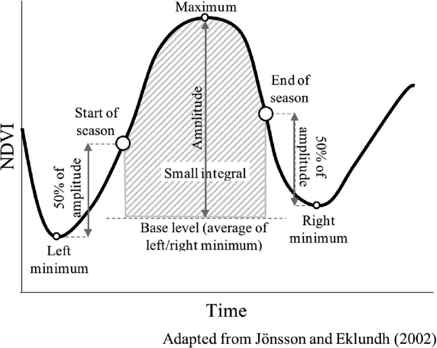
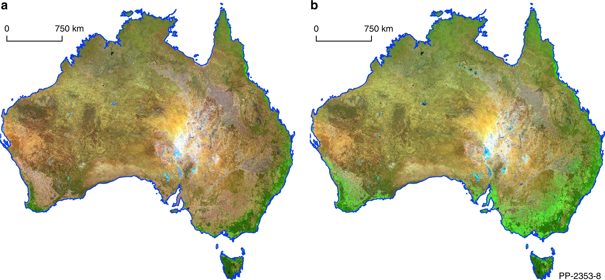

# Synthetic Earth - Temporal aggregation algorithms to generate soil and vegetation analysis-ready satellite data

## Introduction
A GEE JS API implementation of the following algorithms to generate synthetic images of the earth's surface:
- Greenest Earth: Temporal aggregation through the calculation of the small integral [Jönsson & Eklundh, 2002](https://ieeexplore.ieee.org/document/1036010) of a vegetation index profile (default being NDVI).
- Barest Earth: Temporal aggregation through the calculation of the Weighted Geometric Median [Roberts et al., 2019](https://www.nature.com/articles/s41467-019-13276-1) with a negative loss function parameter to select bare(r) pixels.
- Bare Earth: Temporal aggregation through the calculation of the HISET [Heiden et al., 2022](https://www.mdpi.com/2072-4292/14/18/4526) or GEOS3 [Dematte et al., 2018](https://www.sciencedirect.com/science/article/abs/pii/S0034425718302049) algorithm to create bare soil-only composites.

## Features
The algorithms implemented support the creation of application-specific, analysis-ready data corresponding to a given time interval.
The default time interval is a full calendar year due to the fact that it can capture the full phenological cycle of natural surfaces, 
and enables the aggregation to work optimally.

### Greenest Earth

The "Greenest Earth" composite captures the greenness of the vegetation in a more complete way than a "max NDVI" would, 
as it takes both the amplitude and length of the phenology.
This composite is useful for monitoring temporal trends of vegetation greenness in a representative way.

### Barest Earth

The "Barest Earth" composite captures the bareness of the surfaces in a robust way by applying a negative weight factor to a greenness index (i.e. NDVI).
This composite can be used for subsequent analyses of soil brightness over time, albedo studies, or to map soil strata across landscapes.

### Bare Earth

The "Bare Earth" composite identifies in a given time interval the pixels that are effectively bare, 
and whether the bareness is associated to an active cropping cycle or a fallow/permanently bare surface.
This can be particularly useful for studies monitoring spatial coverage of vegetation in and outside croplands, 
especially in the context of the implementation of regenerative agriculture practices monitoring or soil carbon modelling.

## Synthetic Earth Trends

Trends can also be generated from time series of synthetic earth images.

The first trend is the brightness index trend of the Barest Earth time series of images. It is indicative of whether a surface is getting brighter over time or not.

The second trend is the Landtrendr [Kennedy et al., 2018](https://www.mdpi.com/2072-4292/10/5/691) magnitude trend applied to the greenest earth- time series of images. It is indicative of whether a surface is gettin greener over time or not.

## Examples

1. **Synthetic Earth of an agrosilvopastoral area of Burkina Faso**

The script implementing this use case is located under the `examples` folder, and can be accessed via this
[link](https://code.earthengine.google.com/10950fd5f946e4ab75b4eeb4617962a0) directly in the code editor.

The Planetscope NICFI Basemaps are used for the example, but the same procedure can be applied to any optical satellite time series data.

## Dependencies
The JavaScript code for the synthetic reflectance composites generation (`synthetic_earth.js`) runs in the GEE code editor without installing additional packages.

In order to run the NICFI Basemaps example, one needs to [request access](https://developers.planet.com/docs/integrations/gee/nicfi/) to NICFI Basemaps data in Google Earth Engine.

The example provided (`examples/scr_example.js`) relies on set of utilities which can be found in the `utils.js` script.
Other dependencies include:
- [GEE Community Datasets](https://gee-community-catalog.org/): Some datasets provided as community datasets by [Samapriya Roy](https://github.com/samapriya) are instrumental to the example provided.
- [GEE Community's EE Palettes](https://github.com/gee-community/ee-palettes)

## Credits

- [SoilWatch](https://soilwatch.eu/) for driving the meaningful work that lead us to discovering and
  using innovative algorithms for mapping biodiversity and other landscape indicators.
- The [The Planet-NICFI partnership](https://www.planet.com/nicfi/) which is providing us amazing cloud free monthly basemaps to monitor the world's tropical landscapes.
